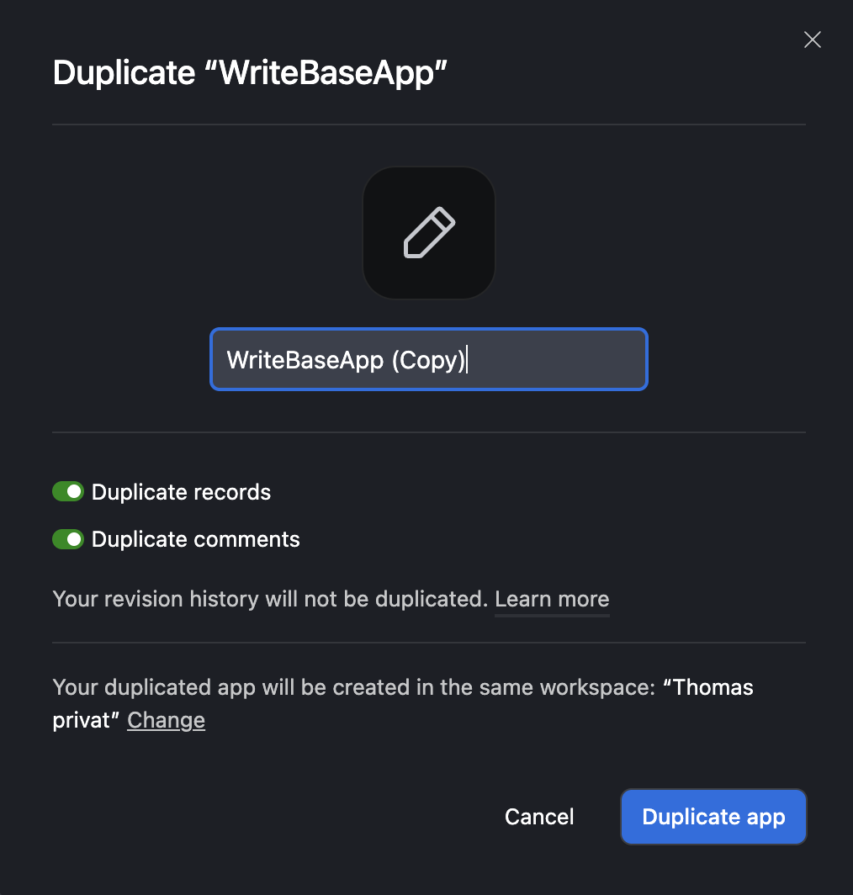
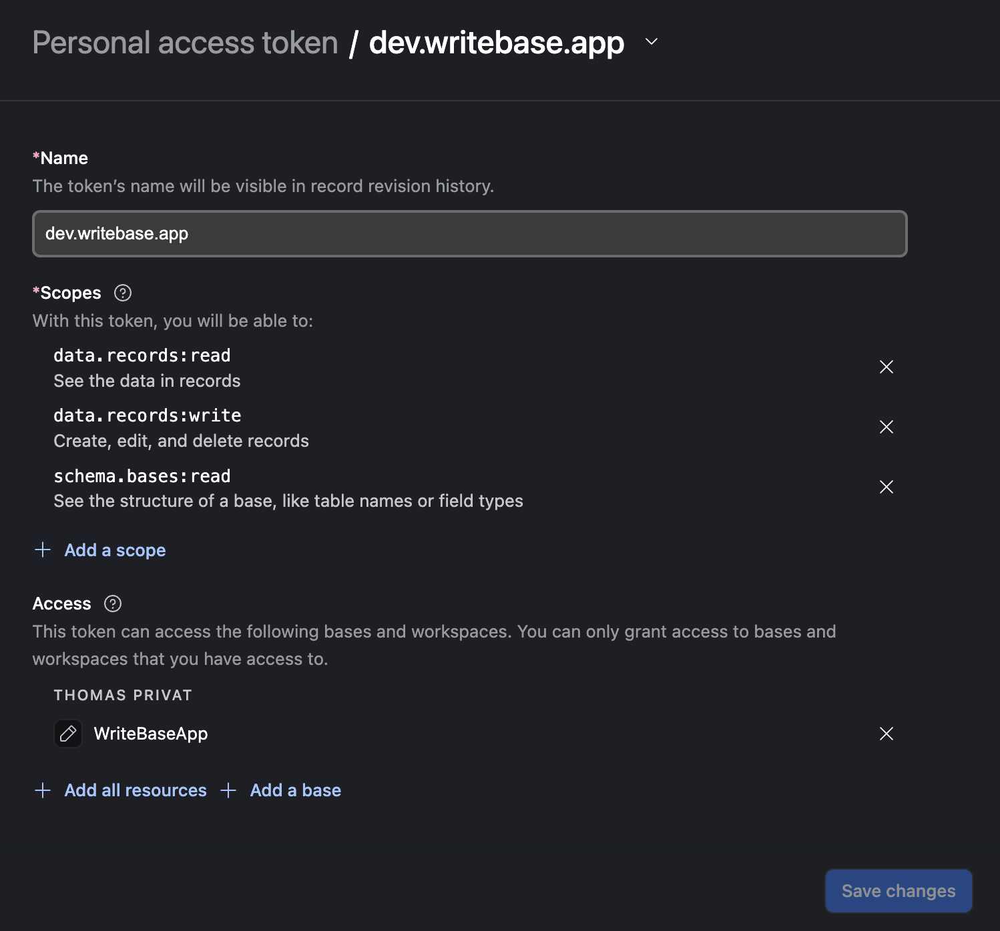
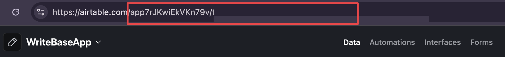

# Getting Started

Get WriteBase connected to your Airtable in 5 minutes.

## What you need

- An Airtable account (free tier works)
- A WriteBase license key

---

## Step 1: Duplicate the template

Open the WriteBaseApp template and click **"Use this data"** to copy it to your Airtable workspace.

→ [WriteBaseApp Template](https://airtable.com/appXXXXXXXX/shrXXXXXXXX) (coming soon)

*Duplicate Airtable Base*
---

---

## Step 2: Create a Personal Access Token

Airtable uses tokens for API access. Create one for WriteBase:

1. Go to [airtable.com/create/tokens](https://airtable.com/create/tokens)
2. Click **"Create new token"**
3. Name it `WriteBase`
4. Add these scopes:
   - `data.records:read`
   - `data.records:write`
   - `schema.bases:read`
5. Under **Access**, select your WriteBase base
6. Click **"Create token"**
7. Copy the token (starts with `pat...`)

*Airtable Personal Tooken*

> ⚠️ Save your token somewhere safe. You won't be able to see it again.

---

## Step 3: Find your Base ID

Your Base ID is in the URL when you open your base in Airtable.

1. Open your duplicated base in Airtable
2. Look at the URL: `https://airtable.com/appXXXXXXXXX/...`
3. or find your base at [developer hub](https://airtable.com/developers/web/api/introduction).
4. Copy the part starting with **app** — that's your Base ID

*Airtable Base ID*

---

## Step 4: Configure WriteBase

Connect WriteBase to your Airtable:

1. Open WriteBase
2. Go to **Settings** (bottom of sidebar)
3. Select the **Connection** tab
4. Enter your **API Key** (the token from Step 2)
5. Enter your **Base ID** (from Step 3)
6. Table Name: **DOCUMENT**
7. Click **"Test Connection"**

*WriteBase Settings Airtable Base*

---

## Done!

Your documents should now appear in the sidebar. Click any document to start writing.

---

## Next steps (comming soon)

- [Publishing to the web](/docs/020-publish) — Set up automated publishing
- [Working with Projects](/docs/030-projects) — Organize documents into projects
- [Using AI Agents](/docs/040-agents) — Enhance your writing with AI

---

## Troubleshooting

| Problem | Solution |
|---------|----------|
| "Invalid API key" | Check that your token has the correct scopes |
| "Base not found" | Verify the Base ID starts with **app** |
| No documents showing | Make sure the Table Name is exactly **DOCUMENT** |
| Connection timeout | Check your internet connection |